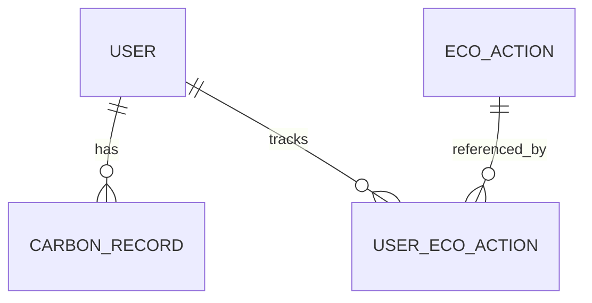

# Base de donnees

## Entites
- User
- CarbonRecord
- EcoAction
- UserEcoAction

## Relations
- User 1..* CarbonRecord
- User 1..* UserEcoAction
- EcoAction 1..* UserEcoAction

## Schema (Mermaid)

## Migration
Voir `migrations/Version20260127141000.php`.